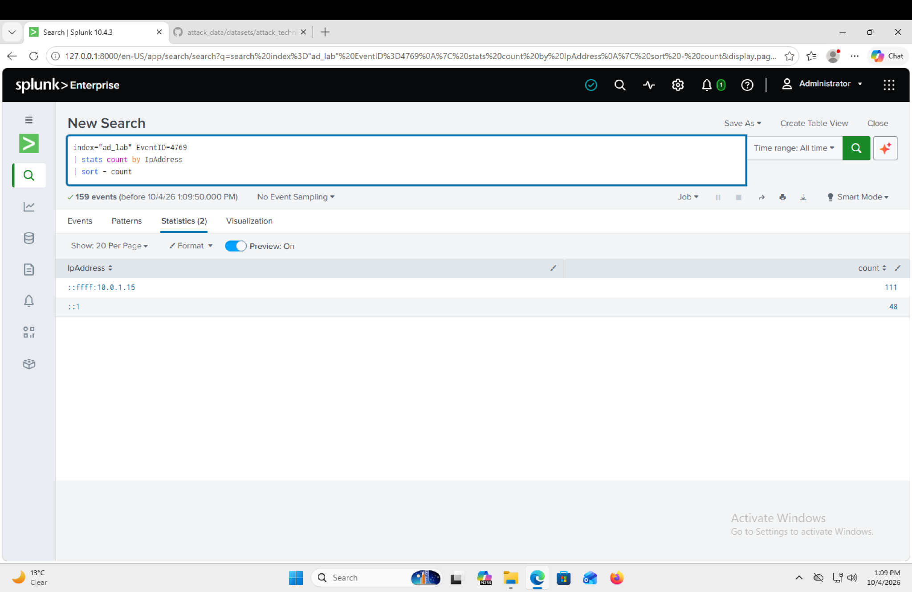
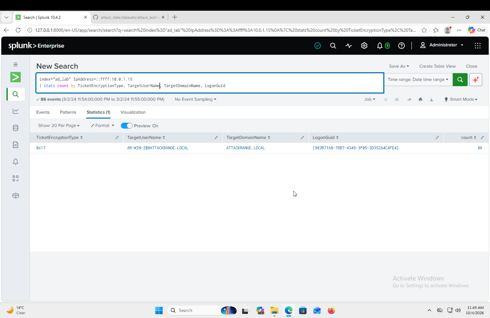
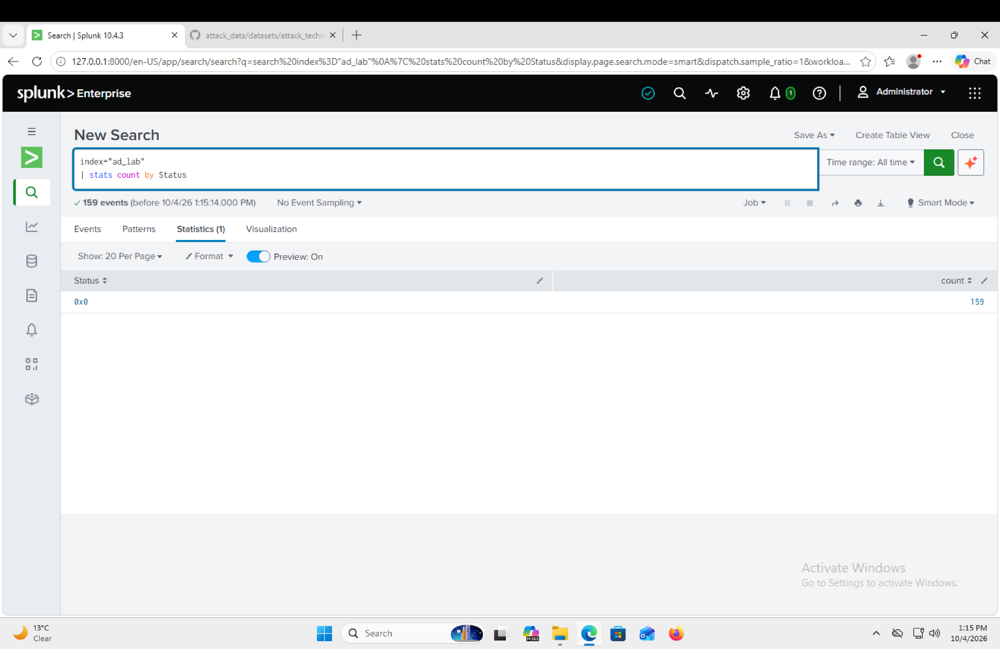
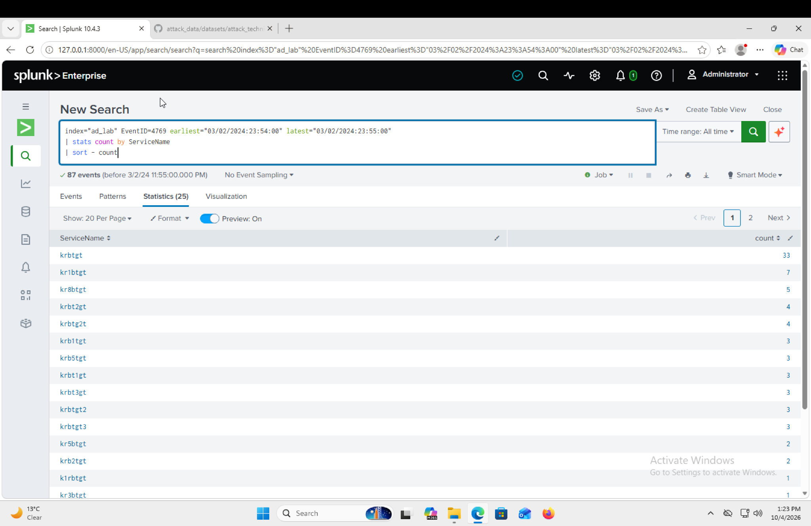

# Kerberoasting Active Directory Investigation

## Overview

In this investigation, I analysed suspicious Kerberos service ticket activity using Splunk and Windows Security logs.

The activity stood out because one host was making a large number of Kerberos service ticket requests within a very short period of time. I investigated the source of the requests, the accounts and services involved, the ticket encryption type, and whether the requests were successful.

The investigation identified behaviour consistent with Kerberoasting, where an attacker requests service tickets that can potentially be taken offline and used to try to recover service account credentials.

## Investigation Environment

- Splunk Enterprise
- Windows Security Event Logs
- Active Directory / Kerberos
- Windows Event ID 4769

## Investigation Goal

The goal was to determine:

- Where the suspicious Kerberos requests were coming from
- How many service tickets were being requested
- Whether the requests were successful
- What encryption type was being used
- Whether the activity was consistent with normal authentication or Kerberoasting
- What response actions should be taken if the activity was confirmed
## Investigation

### 1. Identifying the Source of the Kerberos Requests

I started by reviewing Windows Security Event ID 4769, which records Kerberos service ticket requests.

I grouped the events by source IP address to understand where the requests were coming from.

```spl
index="ad_lab" EventID=4769
| stats count by IpAddress
| sort - count
```
The results showed that `10.0.1.15` was responsible for 111 requests. The other address, `::1`, is the IPv6 loopback address and represented local activity on the system.

This made `10.0.1.15` the main remote source I wanted to investigate further.


### 2. Reviewing the Kerberos Encryption Type

After identifying `10.0.1.15` as the source of interest, I checked the encryption type used for its Kerberos service ticket requests.

```spl
index="ad_lab" EventID=4769 IpAddress=::ffff:10.0.1.15
| stats count by TicketEncryptionType
```

All 111 requests from the host used `0x17`, which represents RC4-HMAC.

RC4 stood out because it is relevant to Kerberoasting. An attacker can request Kerberos service tickets and attempt to crack the encrypted ticket data offline to recover service account credentials.

RC4 alone does not confirm an attack, so I continued looking at the volume, timing and services being requested.


### 3. Checking the Account Behind the Requests

Next, I checked which account was associated with the suspicious ticket requests from `10.0.1.15`.

```spl
index="ad_lab" EventID=4769 IpAddress=::ffff:10.0.1.15
| stats count by TicketEncryptionType, TargetUserName
```

The requests were associated with `AR-WIN-2$@ATTACKRANGE.LOCAL`.

The `$` at the end of `AR-WIN-2$` indicates that this is a computer account rather than a normal user account. This suggested that the suspicious requests were coming from the `AR-WIN-2` system.

At this point I had a likely source system, but I still needed to look at the behaviour of the ticket requests before deciding whether the activity was malicious.


### 4. Checking Whether the Ticket Requests Were Successful

I then checked the status of the Kerberos ticket requests to see whether they were successful or being rejected.

```spl
index="ad_lab" EventID=4769
| stats count by Status
```

All 159 Event ID 4769 events returned a status of `0x0`, which indicates that the Kerberos service ticket requests were successful.

This was important because the activity was not just a series of failed requests. The requested service tickets were actually being issued.


### 5. Analysing the Burst of Service Ticket Requests

I then looked at the timing and volume of the requests. This was where the activity became much more suspicious.

During the investigation I identified a burst of Kerberos service ticket requests around `23:54` on 2 March 2024. I narrowed the investigation to this period and reviewed which services were being requested.

```spl
index="ad_lab" EventID=4769 earliest="03/02/2024:23:54:00" latest="03/02/2024:23:55:00"
| stats count by ServiceName
| sort - count
```

Within roughly one minute, there were 87 service ticket events covering 25 different service names.

This behaviour stood out because normal Kerberos authentication usually relates to services a system actually needs to access. Seeing a large number of service ticket requests across many different services in such a short period was more consistent with automated ticket collection than normal user activity.

When combined with the RC4 encryption, successful ticket requests and the activity from `10.0.1.15`, this significantly increased my confidence that the activity was consistent with Kerberoasting.


## Findings

Based on the evidence, I classified the activity as a **True Positive** and consistent with Kerberoasting.

The main findings were:

- `10.0.1.15` was the main remote source of the suspicious Kerberos requests.
- The activity was associated with the `AR-WIN-2$` computer account.
- The requests used RC4 (`0x17`).
- The Kerberos service ticket requests were successful (`Status 0x0`).
- A large burst of requests occurred within roughly one minute.
- The burst involved 25 different service names.
- The combination of these behaviours was consistent with automated Kerberos service ticket collection rather than normal authentication activity.

## MITRE ATT&CK Mapping

**Tactic:** Credential Access (TA0006)  
**Technique:** T1558.003 – Kerberoasting

The objective of Kerberoasting is to obtain service account credentials. An attacker can request Kerberos service tickets and attempt to crack the encrypted ticket data offline to recover the account password.
## Recommended Response Actions

If I was handling this alert in a live SOC environment, I would escalate the activity and investigate the source host `AR-WIN-2` further to determine what caused the ticket requests.

My next actions would include:

- Isolate the source host if compromise is confirmed or there is an immediate risk.
- Review EDR/process telemetry from `AR-WIN-2` for suspicious PowerShell, command-line activity or known Kerberoasting tools.
- Identify the service accounts targeted by the ticket requests and review their recent authentication activity.
- Reset credentials for any service accounts believed to be compromised.
- Check for signs of lateral movement or privilege escalation using the affected accounts.
- Review whether RC4 is still required in the environment and move eligible accounts towards stronger Kerberos encryption.
- Continue monitoring for unusual volumes of Event ID 4769 activity from other systems.

## Conclusion

This investigation started with suspicious Kerberos service ticket activity and developed into behaviour consistent with Kerberoasting.

The main thing that stood out was not one individual event, but the combination of evidence: a high number of successful service ticket requests, multiple services being requested within a short period, RC4 encryption and the activity being traced back to the same source system.

It was a good example of why I would not classify an authentication alert based on one field alone. Correlating the source, timing, ticket properties and account activity gave much stronger evidence for making the final decision.

**Final Classification:** True Positive  
**MITRE ATT&CK:** T1558.003 – Kerberoasting  
**Tactic:** Credential Access
